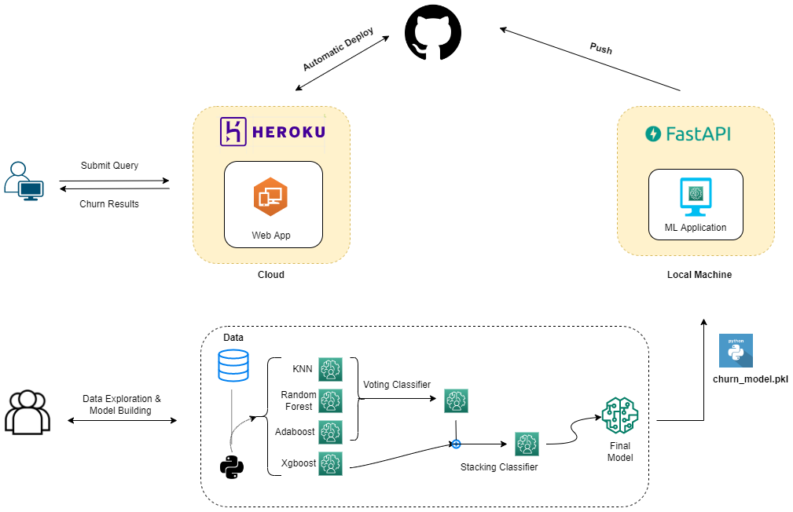

# Customer Churn Prediction 

Churn prediction, or the task of identifying customers who are likely to discontinue use of a service, is an important and lucrative concern of the any industry.


### Description

This project is tasked to predict the churn score for a website based on the features such as:

*    User demographic information
*    Browsing behavior
*    Historical purchase data among other information


### DataSet:

* Dataset taken from a Hakcathon, and raw dataset can be downloaded from here. [Link](https://www.hackerearth.com/problem/machine-learning/predict-the-churn-risk-rate-11-fb7a760d/)
* Cleaned and Processed version data can be accessed from here. [Link](https://github.com/d0r1h/Churn-Analysis/blob/main/DataSet/churnclean.csv)


### Notebook:

Notebook contains the EDA, data processing, and model building ideas. 

| Notebook | Colab | Kaggle |
| ------ | ------ | ------ |
| Customer Churn | [](https://colab.research.google.com/github/d0r1h/Churn-Analysis/blob/main/customer-churn.ipynb) | [](https://www.kaggle.com/code/undersc0re/customer-churn) |

## Models

* Final model used is an ensemble of differnet classifier as it can be seen in figure, such as:
    * KNN
    * Random Forest
    * Xgboost
* It achieves 94.3% of test accuracy with 94.3% f1 score.


## Project Pipeline





### Techstack

**Python version** : 3.7 <br>
**Packages**: pandas, numpy, skelearn, xgboost, fastapi, seaborn <br>
**Cloud**: heroku


### Usage [running this locally]:

```
conda create -n envname python=3.7
activate envname
git clone https://github.com/d0r1h/Churn-Analysis.git
cd Churn-Analysis
pip install -r requirements.txt
python app.py
```

## Inference Demo:

Application is deployed on heroku and can be accessed on https://churn01.herokuapp.com/ and sample data to test app is [here](https://github.com/d0r1h/Churn-Analysis/blob/main/Examples/example_0.txt)

